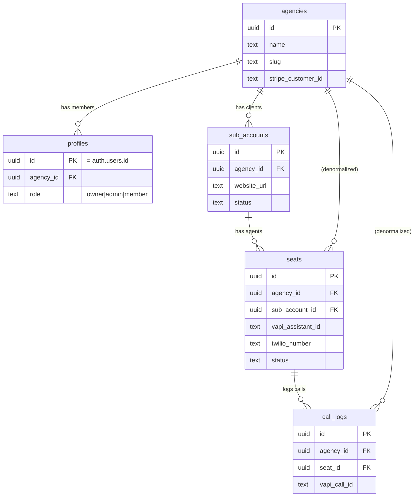
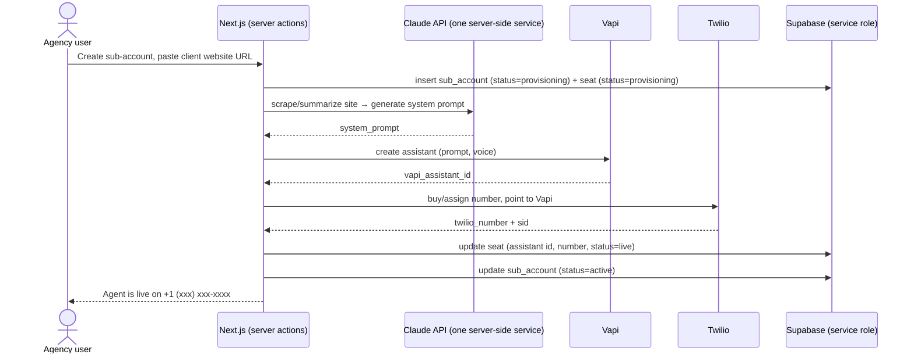

# Sonika — Architecture

Source of truth for the multi-tenant data model, RLS policy model, and the
provisioning flow. Update this doc when the schema changes; treat it as the
contract the app is built against.

## 1. Tenancy model

Sonika is **B2B2B**. Three nesting levels:

```
Agency (tenant root)        ← the customer who pays us (marketing agency)
  └─ Sub-account            ← the agency's end-client (a local business)
       └─ Seat              ← one provisioned voice agent = one billable unit
            └─ Call logs    ← calls handled by that seat's agent
```

- **Tenant boundary = `agency_id`.** Every row in every business table carries
  `agency_id`. A user can only ever see/touch rows matching their own agency.
- **Isolation is enforced by Postgres Row-Level Security**, not by application
  code and not by separate databases (per CLAUDE.md). The app can have bugs;
  the database still refuses cross-tenant reads.
- **`agency_id` is denormalized onto every table** (including `seats` and
  `call_logs`) so every RLS policy is a single indexed equality check with no
  joins. This is a deliberate trade: a little duplication for simple, fast,
  obviously-correct policies.

## 2. Entity relationship



## 3. Schema (migration-ready)

```sql
-- ─────────────────────────────────────────────────────────────
-- Enums (status state machines)
-- ─────────────────────────────────────────────────────────────
create type agency_role     as enum ('owner', 'admin', 'member');
create type sub_account_status as enum ('draft', 'provisioning', 'active', 'paused');
create type seat_status     as enum ('pending', 'provisioning', 'live', 'failed', 'suspended');

-- ─────────────────────────────────────────────────────────────
-- agencies — the tenant root
-- ─────────────────────────────────────────────────────────────
create table agencies (
  id                 uuid primary key default gen_random_uuid(),
  name               text not null,
  slug               text unique,                 -- white-label subdomain handle
  stripe_customer_id text unique,
  created_at         timestamptz not null default now()
);

-- ─────────────────────────────────────────────────────────────
-- profiles — app users, 1:1 with auth.users, scoped to one agency
-- ─────────────────────────────────────────────────────────────
create table profiles (
  id         uuid primary key references auth.users (id) on delete cascade,
  agency_id  uuid not null references agencies (id) on delete cascade,
  email      text not null,
  full_name  text,
  role       agency_role not null default 'member',
  created_at timestamptz not null default now()
);
create index on profiles (agency_id);

-- ─────────────────────────────────────────────────────────────
-- sub_accounts — the agency's end-clients
-- ─────────────────────────────────────────────────────────────
create table sub_accounts (
  id          uuid primary key default gen_random_uuid(),
  agency_id   uuid not null references agencies (id) on delete cascade,
  name        text not null,
  website_url text,
  status      sub_account_status not null default 'draft',
  created_at  timestamptz not null default now()
);
create index on sub_accounts (agency_id);

-- ─────────────────────────────────────────────────────────────
-- seats — one provisioned voice agent; the per-seat billing unit
-- ─────────────────────────────────────────────────────────────
create table seats (
  id                        uuid primary key default gen_random_uuid(),
  agency_id                 uuid not null references agencies (id) on delete cascade,
  sub_account_id            uuid not null references sub_accounts (id) on delete cascade,
  vapi_assistant_id         text,                 -- set after Vapi provisioning
  vapi_phone_number_id      text,                 -- Vapi phone-number resource, for teardown
  twilio_number             text,                 -- E.164, set after Twilio provisioning
  twilio_phone_sid          text,
  system_prompt             text,                 -- Claude-generated, server-side only
  status                    seat_status not null default 'pending',
  stripe_subscription_item_id text,
  created_at                timestamptz not null default now()
);
create index on seats (agency_id);
create index on seats (sub_account_id);

-- ─────────────────────────────────────────────────────────────
-- call_logs — calls handled by a seat's agent (written by Vapi webhook)
-- ─────────────────────────────────────────────────────────────
create table call_logs (
  id               uuid primary key default gen_random_uuid(),
  agency_id        uuid not null references agencies (id) on delete cascade,
  seat_id          uuid references seats (id) on delete set null,
  sub_account_id   uuid references sub_accounts (id) on delete set null,
  vapi_call_id     text unique,
  caller_number    text,
  duration_seconds integer,
  recording_url    text,
  transcript       text,
  summary          text,
  ended_reason     text,
  started_at       timestamptz,
  created_at       timestamptz not null default now()
);
create index on call_logs (agency_id);
create index on call_logs (seat_id);
```

## 4. RLS policy model

Every business table gets RLS enabled. Policies pivot on one helper that
resolves the caller's agency. It is `security definer` so it reads `profiles`
without triggering `profiles`' own RLS (avoids infinite recursion).

```sql
-- Resolve the current user's agency. SECURITY DEFINER bypasses RLS on the
-- profiles read, which prevents policy recursion.
create or replace function auth_agency_id()
returns uuid
language sql
stable
security definer
set search_path = public
as $$
  select agency_id from profiles where id = auth.uid()
$$;

-- profiles: see yourself + agency colleagues; can only edit yourself.
alter table profiles enable row level security;
create policy profiles_select on profiles for select
  using (agency_id = auth_agency_id());
create policy profiles_update_self on profiles for update
  using (id = auth.uid()) with check (id = auth.uid());

-- agencies: see only your own agency.
alter table agencies enable row level security;
create policy agencies_select on agencies for select
  using (id = auth_agency_id());

-- The tenant-scoped tables all follow the same shape.
-- (Repeat this block for sub_accounts, seats, call_logs.)
alter table sub_accounts enable row level security;
create policy sub_accounts_rw on sub_accounts for all
  using      (agency_id = auth_agency_id())
  with check (agency_id = auth_agency_id());
```

**Rules of the model**

- **Reads/writes from the browser** use the Supabase **anon key** and are
  always filtered to `auth_agency_id()`. Cross-tenant access is impossible even
  with a crafted query.
- **`call_logs` are never written from the browser.** Vapi's webhook writes them
  server-side with the **service-role key**, which bypasses RLS. The webhook is
  responsible for stamping the correct `agency_id` (looked up from the seat).
- **Provisioning writes** (`seats.vapi_assistant_id`, `twilio_number`, etc.) and
  **Stripe webhook writes** also run server-side with the service-role key.
- **Role gating** (e.g. only `owner`/`admin` may delete a sub-account) is a v1.1
  refinement — add `and (select role from profiles where id = auth.uid())
  in ('owner','admin')` to the relevant `with check`. MVP lets any agency member
  manage their agency's rows.
- **New-user bootstrap:** on first sign-up, a `profiles` row + (for the first
  user) an `agencies` row must be created. Do this in a server action / DB
  trigger with the service-role key, since a brand-new user has no `agency_id`
  yet and RLS would otherwise block the insert.

## 5. Provisioning flow (onboarding, target < 10 min)



- **All Claude calls route through one server-side service** (cost monitoring per
  CLAUDE.md). No Claude calls from the client.
- Provisioning is **server-only** (Vapi/Twilio secrets never reach the browser).
  If any step fails, set `seat.status='failed'` so the UI can offer a retry.
- Inbound calls hit Twilio → Vapi → Vapi webhook → `call_logs` insert.

## 6. Billing mapping (Stripe, per-seat)

- One Stripe **customer** per agency (`agencies.stripe_customer_id`).
- One subscription per agency; each **live seat** is a quantity/subscription
  item (`seats.stripe_subscription_item_id`). Going `live` increments billing;
  `suspended` decrements. Agency resells at its own margin (we don't model the
  agency→end-client price; that's the agency's business).

## 7. Open questions / deferred

- Multiple seats (numbers) per sub-account — schema already allows it; UI is 1:1
  for MVP.
- Per-seat role permissions, audit log, soft-delete — v1.1+.
- `slug`-based white-label subdomains — column reserved, routing deferred.
